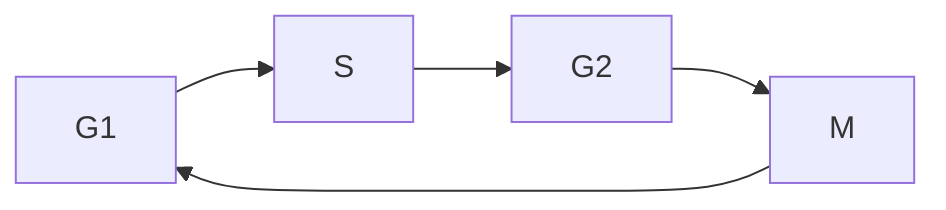

# 细胞周期
@import "D:/Documents/markdown/scribble.css"                                   
---
**目录**：
[TOC]
---
## 1.基本定义

Interphase:
- **G1**: cell growth
- **S**: DNA synthesis
- **G2**: fidelity check

Mitotic phase:
- Mitosis
  - **Prophase** ——前期
  - Prometaphase —— 前中期
  - Metaphase —— 中期
  - Anaphasel —— 后期
  - Telophase —— 末期
- Cytokinesis —— 胞质分裂

细胞必须对环境敏感，在适宜的条件下快速增殖，在恶劣的条件下保护自我。
细胞增殖必须足够准确，但不能完美。
**如何保真？**
- Perfection of machinery
- **Quality control (checkpoint/检查点)**

---
## 2.酵母细胞周期调控
1.Yeast is an ideal model organism for **cell cycle studies**. 
2.Different yeasts have distinct cell cycle behaviors.

**Cdc2 is an essential gene for fission yeast mitosis.**

**The fission yeast cell cycle is driven by Cdc2 activation cycle.**

**细胞周期是高度有序的。**

1.Dependency of M on S phase:
- block S--> no M entry

2.Dependency of S on M phase:
- block M--> no S entry

3.Exceptions：
Polytene chromosomes/多线染色体 (no M)
Early embryogenesis/早期胚胎发生 (no G1)

---

## 3.高等生物细胞周期调控
> 高等动物细胞里面 **Cdk1 = Cdc2**

How can cyclin(细胞周期因子) levels fluctuate during the cell cycle?

Cyclins are subjected to
- stage-specific gene expression controls ,阶段特异性的基因表达。
- rapid protease-mediated degradation 

Cdk inhibitors (Cki) add additional layer of regulations:

---
## 4.G1 -->S期
>最主要的检查点是位于G1末期的 **G1 checkpoint**，在高等动物里面称为 **Restriction point/R point**。主要检查细胞的大小和周围的环境条件，决定细胞是否进入S期。

有多条信号通路调控G1期cdk的激活来调控细胞周期：

1.The G1 checkpoint monitors cell size.
2.The G1 checkpoint monitors **fidelity of the genome**.

- p53是DNA损伤应答通路中的关键因子：
    - P53是转录因子；
    - ** P53是肿瘤抑制因子。**--> Guardian of the genome！

3.What is the key Cdk substrate gatekeeping the R point?
> **Retinoblastoma protein (Rb) / 视网膜母细胞瘤蛋白** 
- Rb is a tumor suppressor gene!(肿瘤抑制基因).
- Rb在G1期末期被cdks **高度磷酸化**。磷酸化的Rb才发挥功能。
    - Tumor viruses inactivate Rb by neutralizing its activity！
- The **TBD(T-binding domain of Rb)** is critical for the tumor suppression function of Rb.
- The TBD might hold protein(s) critical for S phase progression.
    - **E2F** / Rb-associated protein
> **E2F** regulates transcription of multiple genes important for **S phase**.
- DNA synthesis & chromatin assembly:TK,PCNA,histone H2A;
- cell cycle regulators:Cyclin A,E,D1,Rb,E2F1;
- Proto-oncogene MYC.

4.模式图（总结前面）

1.Rb binds to and prevents E2F from activation in early G1 phase!
**Rb在G1期早期与E2F结合，阻止E2F在早期的激活，在通过G1期的R point 之后发挥作用。**

---
##5.有丝分裂
###5.1 有丝分裂的阶段
>The spindle(纺锤体) and kinetochores(动粒) of chromosomes constitute the mitotic apparatus.

M期可以分为六个阶段：
- 前期：染色体开始凝聚、纺锤体开始形成、 核膜完整
- 前中期：**核膜破裂**，染色体未完成排列
- 中期：染色体完全排列在赤道板上
- 后期：染色单体分离
- 末期：染色体解凝聚，**核膜重新形成**
- 胞质分裂：缢缩环形成至子细胞分离
###5.2 spindle 微管
>MT-based molecular motors are critical for spindle assembly:
kinesin——驱动蛋白；
dynein——动力蛋白；

1.Vertebrate spindle contains a lamin B-enriched spindle matrix important for spindle formation.
脊椎动物主轴包含富含纤维素B的 **纺锤体基质对于纺锤形成很重要**.
2.Spindle matrix is a supramolecular network formed through protein phase transition.
纺锤体基质是通过**蛋白质相变**形成的**超分子网络**.
3.Spindle matrix might regulate cell fate.
纺锤体基质可能会调控细胞命运。
- 开放有丝分裂可能通过**纺锤体基质**调节后生动物**细胞命运**.

###5.3 kinetochore (动粒)

###5.4 MT-kinetochore interaction 微管动粒相互作用
**分子马达对染色体运动至关重要!!!**
 - dynein——拉；
 - kinesin——推。

Inactivation of dynein impairs the poleward pulling force on kinetochores / 动力蛋白的失活削弱了动粒上的极向拉力

**Do MTs know which kinetochores to attach?**
1.Incorrect MT-kinetochore attachments can occur in prometaphase. / 前中期可能会发生错误的微管动粒连接。
2.Incorrect MT attachments can be restored.

###5.5 spindle checkpoint(纺锤体检查点)
1.Cells with unattached or misattached chromosomes cannot initiate anaphase unless the spindle checkpoint is compromised.
2.The spindle checkpoint guarantees proper anaphase onset.
 - A **single** unattached kinetochore is sufficient to **block anaphase onset!!!**

Detailed mechanism of the spindle checkpoint:

(1) 未结合微管的动粒上MPS1磷酸化KNL1；
(2) 磷酸化KNL1结合Bub1和Bub3，招募BubR1和Mad3；
(3) 上述复合物招募Mad1-Mad2二聚体；
(4) 二聚体将开放状态的Mad2催化为关闭状的Mad2；
(5) 关闭状的Mad2结合Cdc20；
(6) 进一步结合其它检查点蛋白形成MCC。

(1) MPS1脱离动粒，使Bub3复合物脱离；
(2) Dynein将其它蛋白质搬离动粒;
(3) 闭合状的Mad2不能产生，对Cdc20的抑制消失；
(4) Cdc20激活APC，降解Securin和Cyclin B。
(5) Securin被降解，激活seperase,从而降解连接姐妹染色单体的cohesin。
###5.6 特殊的细胞分裂
1.Synchronized mitosis in Drosophila embryo.
果蝇胚胎同步有丝分裂。
2.Polarized cell division in epithelia.
上皮细胞中的极化细胞分裂。
3.Asymmetric cell division of stem cells
干细胞的不对称细胞分裂。
